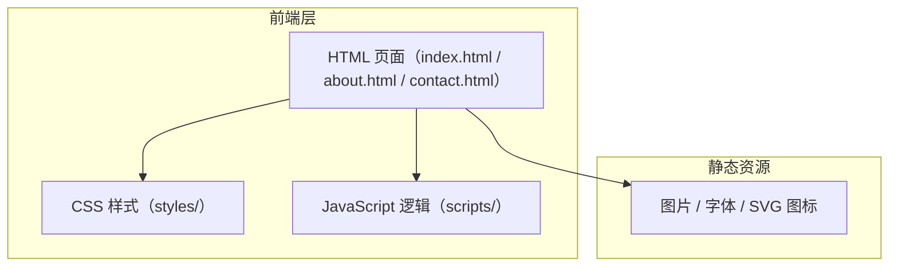

## 1. 架构设计



## 2. 技术说明

- 前端：原生 HTML5 + CSS3 + JavaScript（ES6+）
- 构建工具：无（纯静态文件，直接浏览器访问）
- 后端：无
- 数据库：无
- 开发服务器：使用 `npx serve` 或 Python `http.server` 提供本地静态服务

### 技术选型理由

用户明确要求使用原生 HTML、CSS 和 JavaScript，不使用任何框架。因此不引入 React、Vue 等框架，也不使用构建工具，保持纯静态文件结构。

## 3. 路由定义

| 路由 | 文件 | 用途 |
|------|------|------|
| / | index.html | 首页，展示 Hero 和特性卡片 |
| /about | about.html | 关于页，团队介绍和项目愿景 |
| /contact | contact.html | 联系页，表单和联系信息 |

## 4. 项目结构

```
0002/
├── index.html              # 首页
├── about.html              # 关于页
├── contact.html            # 联系页
├── css/
│   ├── reset.css           # 样式重置
│   ├── variables.css       # CSS 变量定义
│   ├── nav.css             # 导航栏样式
│   ├── home.css            # 首页样式
│   ├── about.css           # 关于页样式
│   └── contact.css         # 联系页样式
├── js/
│   ├── nav.js              # 导航栏交互逻辑
│   └── pages.js            # 页面特定逻辑
└── assets/                 # 静态资源（图片等）
```

## 5. 导航栏交互实现方案

### 核心功能

1. **横向菜单**：桌面端导航菜单项水平排列
2. **展开/折叠下拉菜单**：点击含子菜单的菜单项，通过 CSS `max-height` 过渡动画展开/折叠
3. **Hover 效果**：菜单项 hover 时背景色渐变 + 底部装饰线滑入
4. **当前页面高亮**：通过 JavaScript 读取当前页面路径，为对应菜单项添加 `active` 类
5. **移动端汉堡菜单**：小屏幕下显示汉堡按钮，点击展开侧滑菜单

### 状态管理

- 使用 `data-page` 属性标识每个页面
- 使用 CSS 类 `.active` 控制高亮状态
- 使用 `aria-expanded` 属性管理下拉菜单的可访问性状态
